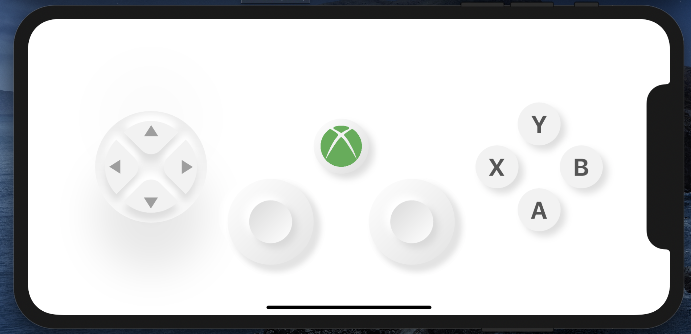

# ClayContainer demo : A Neumorphic container
[visit clay_containers](https://pub.dev/packages/clay_containers#-readme-tab-)
## Steps to use 

1. Add dependency

       dependencies:
            clay_containers: ^version

2. Start using

        ClayContainer(
                color: baseColor,
                height: 200,
                width: 200,
                child:Center(child:newChild) //Put child inside Center to align it centrally.
                depth:45, // negative elevation(both +ve & -ve)
                curveType: CurveType.convex, //Curve of surface (concave, convex, plane)
                borderRadius: 200,
              )

## Result

